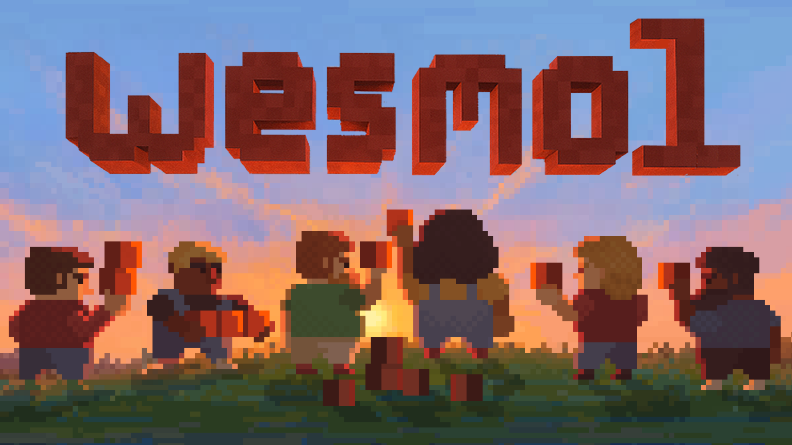
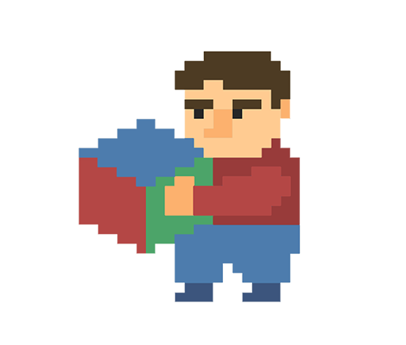

# about

<figure><figcaption></figcaption></figure>

## who are we

We are adopters, we are experimenters, we are adventurers, we are builders, we are creators.

Together, we are exploring the burgeoning universe of web3. Our community welcomes people with diverse skillsets and interests, from newcomers to crypto to seasoned builders and explorers. We are building an inclusive space for any who share our curiosity and vision of a collaborative future. We believe that together we can accomplish extraordinary things.

Together, we are smol.

## what we believe

We believe in the transformative power of decentralized systems and the change they promise. There is a growing community of like-minded individuals interested in the developments and possibilities enabled by web3, who are seeking ways to experiment, to explore, and collaborate. We believe that code can be used to improve the way that we interact with each other and we believe that we can actively shape its implementation, as builders and users, for the better.

We also believe that identity and community networks are essential for navigating and exploring the digital world. A strong network makes your journey more enjoyable, opens doors to opportunities, and connects you with others. We believe that digital identity can transcend the screen and create meaningful connections to people's daily lives. We believe that more people will seek this connection.

## our mission

This isn't something we can build alone, nor is it something anyone can own. This is just an idea we think is worth contributing to and a purpose worth organizing around. We're building a community that serves as an example of what collaboration can look like and demonstrates the power of common purpose. A community that collectively experiments, explores, and actively shapes the objects, contracts, systems, and economies enabled by blockchain.&#x20;

Our goal is to show that when individuals come together with shared intention, they can do something much larger than themselves.

### $SMOL&#x20;


{% column width="33.33333333333333%" %}

<figure><figcaption></figcaption></figure>



{% column width="66.66666666666664%" %}
SMOL is a token created to symbolize the idea our community is built on and its shared mission. It carries no intrinsic value or expectation of financial return. The token does not have any rights or claim on any business activities.

There is only the possibility that individuals out there identify as smol, and there is no limit to what they provide each other and accomplish together.



## socials

We're using the below Discord server and Twitter account to kick start the wesmol idea and incubate the community. Discord is our home. As a decentralized brand, there are no restrictions on anyone creating their own channels for advancing the wesmol brand and developing its community. We hope this happens organically and without permission. In fact, we encourage it.&#x20;

### join us:

Discord: [https://discord.gg/ndsa4GzpTt](https://discord.gg/ndsa4GzpTt)

Twitter: [@wesmol](https://x.com/wesmol)
